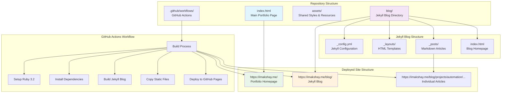
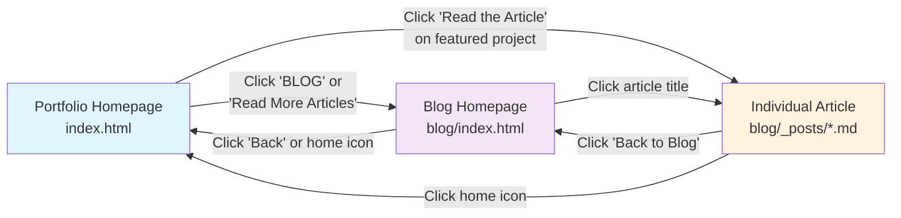
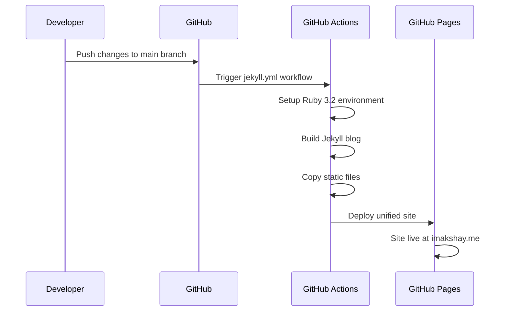

# Akshay's Portfolio & Blog

A modern portfolio website with an integrated Jekyll blog, showcasing projects and technical articles. The site combines a static portfolio homepage with a dynamic Jekyll-powered blog system.

## 🏗️ Architecture Overview

This project uses a hybrid architecture combining a static HTML portfolio with a Jekyll blog, deployed via GitHub Actions to GitHub Pages.



## 🚀 How It Works

### 1. **Static Portfolio (index.html)**
- **Location**: Root directory (`/index.html`)
- **Purpose**: Main portfolio page showcasing projects and skills
- **Technology**: Pure HTML with Tailwind CSS
- **URL**: `https://imakshay.me/`

### 2. **Jekyll Blog (blog/ directory)**
- **Location**: `/blog/` subdirectory
- **Purpose**: Technical articles and project deep-dives
- **Technology**: Jekyll static site generator
- **URL**: `https://imakshay.me/blog/`

### 3. **GitHub Actions Integration**
The deployment process uses GitHub Actions to:

```yaml
# Simplified workflow process
1. Checkout repository
2. Setup Ruby 3.2 environment
3. Install Jekyll dependencies
4. Build Jekyll blog → _site/blog/
5. Copy static files → _site/
6. Deploy unified site to GitHub Pages
```

## 📁 Project Structure

```
akshaysharma-akay.github.io/
├── index.html                 # Main portfolio page
├── assets/
│   └── styles/               # Shared CSS files
├── blog/                     # Jekyll blog directory
│   ├── _config.yml          # Jekyll configuration
│   ├── _layouts/            # HTML templates
│   │   ├── default.html     # Base layout
│   │   └── post.html        # Article layout
│   ├── _posts/              # Blog articles (Markdown)
│   │   ├── 2025-07-19-hello-world-lorem-ipsum.markdown
│   │   └── 2025-07-19-reimagining-autodocs-2025.markdown
│   ├── index.html           # Blog homepage
│   ├── Gemfile              # Ruby dependencies
│   └── Gemfile.lock         # Locked dependency versions
├── .github/
│   └── workflows/
│       ├── jekyll.yml       # Main deployment workflow
│       └── debug-build.yml  # Debug workflow
├── .gitignore               # Git ignore patterns
└── README.md                # This file
```

## 🔗 URL Mapping & Navigation

### URL Structure
```
Portfolio:
├── https://imakshay.me/                    → index.html (Portfolio)
├── https://imakshay.me/blog/               → blog/index.html (Blog Home)
└── https://imakshay.me/blog/projects/automation/2025/07/19/reimagining-autodocs-2025.html
    └── Generated from: blog/_posts/2025-07-19-reimagining-autodocs-2025.markdown
```

### Navigation Flow


## 🛠️ Development Setup

### Prerequisites
- Ruby 3.2+
- Bundler 2.7.0+
- Git

### Local Development

1. **Clone the repository**
   ```bash
   git clone https://github.com/AkshaySharma-Akay/akshaysharma-akay.github.io.git
   cd akshaysharma-akay.github.io
   ```

2. **Setup Jekyll blog**
   ```bash
   cd blog
   bundle install
   bundle exec jekyll serve
   ```

3. **Access locally**
   - Portfolio: Open `index.html` in browser
   - Blog: `http://localhost:4000`

### Adding New Blog Posts

1. Create a new Markdown file in `blog/_posts/`
2. Follow the naming convention: `YYYY-MM-DD-title.markdown`
3. Include proper front matter:

```yaml
---
layout: post
title: "Your Article Title"
date: 2025-07-19 21:00:00 +0530
categories: [category1, category2]
tags: [tag1, tag2, tag3]
excerpt: "Brief description of the article"
---
```

## 🚀 Deployment

### GitHub Pages Configuration
1. Repository → Settings → Pages
2. Source: **"GitHub Actions"** (not "Deploy from branch")
3. The workflow automatically triggers on push to `main` branch

### Deployment Process


## 🎨 Design System

### Typography
- **Primary Font**: Inter (modern, professional)
- **Weights**: 300, 400, 500, 600, 700, 800
- **Usage**: Consistent across portfolio and blog

### Color Palette
- **Primary Blue**: `#2563EB` (blue-600)
- **Secondary Blue**: `#3B82F6` (blue-500)
- **Success Green**: `#059669` (green-600)
- **Text Gray**: `#111827` (gray-900)
- **Background**: `#FFFFFF` (white)

### Components
- **Cards**: Rounded corners, subtle shadows, hover effects
- **Buttons**: Consistent padding, smooth transitions
- **Navigation**: Fixed header with mobile-responsive menu

## 📊 Performance Features

- **Fast Loading**: Minimal CSS, optimized fonts
- **SEO Optimized**: Proper meta tags, structured URLs
- **Mobile Responsive**: Works on all device sizes
- **Accessibility**: Proper contrast ratios, semantic HTML

## 🔧 Technical Stack

### Frontend
- **HTML5**: Semantic markup
- **Tailwind CSS**: Utility-first styling
- **JavaScript**: Minimal, vanilla JS for interactions
- **Font Awesome**: Icon library

### Blog Engine
- **Jekyll 4.4.1**: Static site generator
- **Liquid**: Templating language
- **Markdown**: Content format
- **Rouge**: Syntax highlighting

### Deployment
- **GitHub Actions**: CI/CD pipeline
- **GitHub Pages**: Free hosting
- **Ruby 3.2**: Build environment

## 📈 Analytics & Monitoring

- **Google Analytics**: Integrated tracking (G-H41739MRVS)
- **Performance**: Lighthouse scores optimized
- **Error Tracking**: GitHub Actions build logs

## 🤝 Contributing

1. Fork the repository
2. Create a feature branch
3. Make your changes
4. Test locally
5. Submit a pull request

## 📄 License

This project is open source and available under the [MIT License](LICENSE).

## 📞 Contact

- **Email**: akshaysharmaak2@gmail.com
- **LinkedIn**: [akshay-sharma-akay](https://www.linkedin.com/in/akshay-sharma-akay/)
- **GitHub**: [AkshaySharma-Akay](https://github.com/AkshaySharma-Akay)

---

*Built with ❤️ by Akshay Sharma*