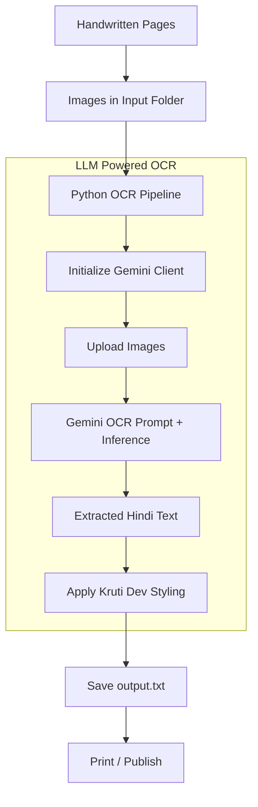
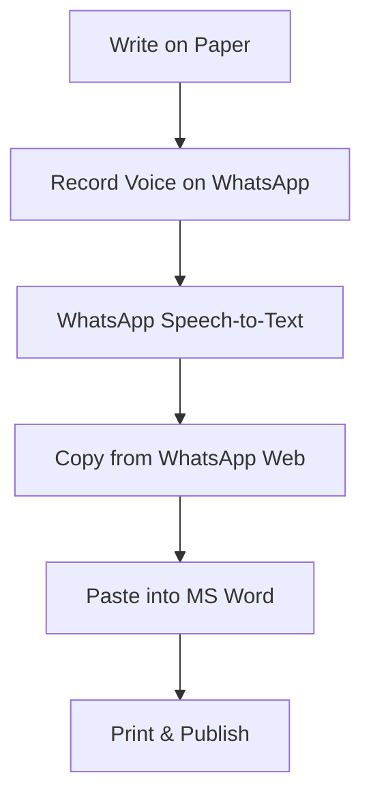

## Background Story
I grew up in a household where education was everything. My father—a teacher and writer who often switched between roles—spent his entire career working in **Hindi**. That naturally made me and my siblings the tech support at home. Over the years, we typed his academic papers in Kruti Dev fonts, maintained these documents, and built archives of his work on Google Drive and pen drives.

Among all those tasks, one problem kept returning like a stubborn bug:

### **Typing handwritten pages.**

Whenever he had written 10–20 pages by hand, turning them into a typed Word or PDF document required either:
- paying someone to type it, or
- learning MS Word + Hindi typing, or
- asking me / siblings

And this cycle kept repeating.

So I finally formalized the simplest version of the problem:

> Problem Statement:
> 
> Given handwritten Hindi pages, take images/PDFs and generate a clean PDF or .docx typed in the font specified by the user
> 
> (default: **Kruti Dev 010**).
> 

This became one of those side projects that follows you for year, too small to commit months to, too persistent to ignore.

---

## Hindi OCR Attempt #1 (2022–2023): Traditional Machine Learning Fails

Back in 2022, the only way to solve this realistically was through **OCR + Machine Learning**.

### My plan:

1. Try every existing OCR I could.
2. Read research papers on Hindi OCR.
3. Build a custom model if needed.

### Reality:

- OCR for English = great
- OCR for Hindi = painful
- Unicode ↔ Kruti Dev = messy
- Research papers = promising academically, but impractical as a side project
- Implementation = several months of work

I created repos, notes…

But eventually concluded:

**ROI < Effort.**

So I dropped it.

---

## Solution Attempt #2 (End of 2025): LLMs Change the Game

Fast forward to 2025.

During a hackathon at work, I finally got hands-on with **Google ADK** and built my first **Agentic AI flow**. That single experience reignited this old problem. The thought hit me:

> “Could this problem that felt huge in 2022 be solved with a simple LLM pipeline now?”
> 

Spoiler: yes.

---

## User Research: Conversations With Home Users

Before building anything, I decided to validate the problem. I asked three simple questions to understand the actual workflow.

**Q1: How much do you pay nowadays to get things typed?**
> "Not much anymore."

**Q2: Have you tried ChatGPT or Gemini for it?**
> "No. Students use it… but we don't understand it."

**Q3: What tool do you use today?"**
> "WhatsApp."

---

This surprised me.

But it made perfect sense.

### **The WhatsApp Workflow**

Here's what the "real-world" workflow looked like:

- Voice notes are recorded in Hindi.
- WhatsApp converts them to text.
- My siblings copy-paste from WhatsApp Web → MS Word.
- They print and publish.
- Any edits happen directly *inside WhatsApp messages*.

It was chaotic but effective.

A reminder that good products don’t beat other products, they beat **existing habits and my solution too some extend.**

---

## Building the MVP With LLMs

Once I started experimenting, I realized:

- LLMs can extract Hindi text far better than OCR pipelines.
- No need for training datasets.
- No need for research papers.
- No need for custom ML models.

Just:

- one script
- one prompt
- one LLM API call

Even more interesting:

Both ChatGPT (free) and Gemini Pro (via Jio) recommended the same solution direction → **simple API integration > agentic system** for this use case.

Then I found a video on the Gemini Python client, opened ChatGPT, asked it to scaffold the script, debugged some hallucinated imports, and…

Within **2–3 hours**, I had a working MVP.

A problem that felt *months long* in 2022 had become a *weekend experiment* in 2025.

---

## The New LLM Workflow



---

## The Old Workflow (For Contrast)



---

## The Prompt That Powered the System

```
You are an OCR expert.

If the text in the image is handwritten or printed in Hindi:
- Extract the content.
- Return the text in Unicode Hindi, styled like Kruti Dev 010.

If the text is in English:
- Extract and return clean English text.

Output only the extracted textual content without explanation.
```

This tiny piece of text did more heavy lifting than months of ML experimentation in 2022.

---

## The Core Code (Simplified)

```python
    client = get_gemini_client()
    prompt = """
    You are an OCR expert.
    Extract Hindi or English text.
    Return clean Unicode text styled like Kruti Dev 010.
    """

    image_files = get_image_files(settings.INPUT_DIR)
    uploaded_files = upload_files(client, image_files)

    text = client.models.generate_content(
        model=settings.OCR_MODEL,
        contents=[prompt] + uploaded_files
    ).text

    save_output_file(text, settings.OUTPUT_DIR / "output.txt")
    client.close()
```

---

## Conclusion

What once felt like months of work is now a weekend project, and that alone shows how fast things are changing. Building my first agentic flow during the hackathon—and now an even simpler LLM script—spiked my curiosity again. It's tempting to extend this into a bigger product, but not every problem needs a hammer.

There are still real questions around privacy, data usage, product fit, and ROI.

Some ideas turn into companies.

Some simply make life easier for the people around you.

This script does the latter—and for now, that's more than enough.

---

## Coming in Part 2

***Real-world accuracy tests and other findings, failure cases, full code, and the GitHub repository and all youtube and documentation references.***